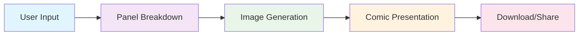
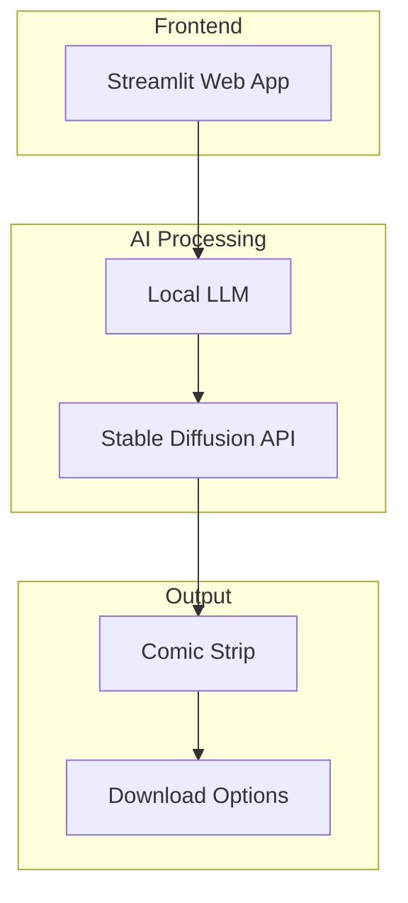

# 🎨 ComicAI

> **Transform your ideas into unique comic strips!** ComicAI lets you enter a short story or idea, splits it into comic panels using a local AI model, and generates original images for each panel, presenting everything in a beautiful comic strip layout.

[](https://python.org)
[](https://streamlit.io)
[](https://openai.com)
[](LICENSE)

---

## 🚀 Project Overview

ComicAI is a creative, AI-powered tool that lowers the barrier for anyone to create a comic strip, using free, accessible AI models for both text and images. It demonstrates a practical, fun AI pipeline and encourages creative expression without the need for artistic skills or paid services.

### ✨ Key Features

- 🎯 **Simple Story Input** - Just type your idea and let AI do the rest
- 🤖 **AI-Powered Panel Generation** - Automatic story breakdown into comic panels
- 🎨 **Original Image Creation** - Unique illustrations for each panel
- 📱 **Beautiful Web Interface** - Clean, intuitive Streamlit app
- 💾 **Download & Share** - Export your comics in multiple formats
- 🆓 **Completely Free** - No paid services required

---

## 🎯 Problem & Opportunity

Many people have creative ideas for comics or stories but lack the artistic skills or tools to bring them to life. **ComicAI empowers anyone to turn their imagination into a visual comic strip quickly and for free**, using AI models that run locally or with free APIs.

### Target Users

- 📝 **Storytellers** - People with creative ideas but limited artistic skills
- 🎓 **Students** - Educational projects and presentations
- 📱 **Content Creators** - Social media content and blog illustrations
- 🏢 **Businesses** - Marketing materials and presentations
- 🎨 **Artists** - Quick prototyping and concept development

---

## 🔄 Core Flow (MVP)



### 1. **User Input**
The user enters a short story, scenario, or idea in a text box.

### 2. **Panel Breakdown**
A local LLM (e.g., TinyLlama, Qwen) divides the story into 3–5 scene descriptions (comic panels).

### 3. **Image Generation**
For each scene, a prompt is sent to a free text-to-image API (Hugging Face Spaces – Stable Diffusion) to create an original illustration.

### 4. **Comic Presentation**
The generated images and scene texts are displayed together as a comic strip in a Streamlit web app.

### 5. **Download/Share** *(Optional)*
The user can download their comic as images or share it.

---

## 🤖 AI Pipeline

```
User Story/Idea 
    ↓
[Local LLM: Split story into panels]
    ↓
Scene Descriptions
    ↓
[Free API (Stable Diffusion via Hugging Face Spaces): Generate images]
    ↓
Comic Panels
    ↓
[Streamlit: Display comic strip]
```

---

## 🛠️ AI Services & Tools

| Component | Technology | Purpose |
|-----------|------------|---------|
| **Local LLM** | Ollama/TinyLlama/Qwen | Breaking user stories into short panel/scene descriptions |
| **Image Generation** | Stable Diffusion Text-to-Image API (Hugging Face Spaces) | Generating unique illustrations for each panel prompt |
| **Web Interface** | Streamlit | User interface and comic strip display |
| **Voice Input** *(Optional)* | Whisper/SpeechRecognition | Voice input functionality |

---

## 🚀 Getting Started

### Prerequisites

- Python 3.8+
- Streamlit
- Access to Hugging Face Spaces API
- Local LLM setup (Ollama recommended)

### Installation

```bash
# Clone the repository
git clone https://github.com/yourusername/comicai.git
cd comicai

# Install dependencies
pip install -r requirements.txt

# Run the application
streamlit run app.py
```

### Usage

1. **Start the App** - Launch the Streamlit web interface
2. **Enter Your Story** - Type or paste your creative idea
3. **Generate Comic** - Click the generate button
4. **View Results** - See your comic strip come to life
5. **Download** - Save your creation for sharing

---

## 📊 Technical Architecture



---

## 🎨 Example Output

```
Input: "A cat discovers a magical garden and meets talking flowers"

Output: 4-panel comic strip with:
- Panel 1: Cat looking curiously at garden gate
- Panel 2: Cat entering the magical garden
- Panel 3: Cat talking to colorful flowers
- Panel 4: Cat and flowers having a tea party
```

---

## 🔮 Future Enhancements

- [ ] **Voice Input** - Speak your story instead of typing
- [ ] **Multiple Art Styles** - Choose different visual themes
- [ ] **Character Consistency** - Maintain character appearance across panels
- [ ] **Advanced Layouts** - More complex comic strip arrangements
- [ ] **Social Sharing** - Direct sharing to social media platforms
- [ ] **Collaboration** - Multi-user comic creation

---

## 🤝 Contributing

We welcome contributions! Please see our [Contributing Guidelines](CONTRIBUTING.md) for details.

### How to Contribute

1. Fork the repository
2. Create a feature branch (`git checkout -b feature/AmazingFeature`)
3. Commit your changes (`git commit -m 'Add some AmazingFeature'`)
4. Push to the branch (`git push origin feature/AmazingFeature`)
5. Open a Pull Request

---

## 📄 License

This project is licensed under the MIT License - see the [LICENSE](LICENSE) file for details.

---

## 🙏 Acknowledgments

- **Hugging Face** - For providing free AI model APIs
- **Streamlit** - For the amazing web app framework
- **Stable Diffusion** - For image generation capabilities
- **Open Source Community** - For inspiration and support

---

## 📞 Contact

- **Project Link**: [https://github.com/yourusername/comicai](https://github.com/yourusername/comicai)
- **Issues**: [GitHub Issues](https://github.com/yourusername/comicai/issues)
- **Discussions**: [GitHub Discussions](https://github.com/yourusername/comicai/discussions)

---

<div align="center">

**Made with ❤️ by the ComicAI Team**

[](https://github.com/yourusername/comicai)
[](https://github.com/yourusername/comicai)

</div>
